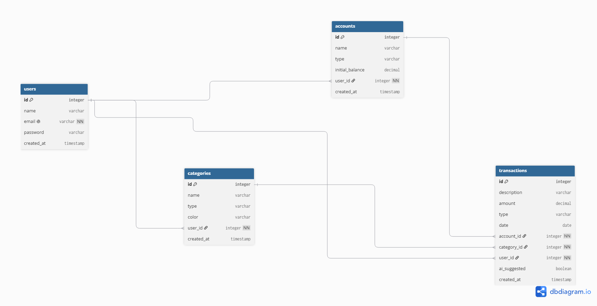

# Modelo de Dados — Cofrin

## Visão geral

O sistema modela um fluxo onde o usuário tem contas bancárias e movimenta o dinheiro dele
por meio de transações e cada transação vai ter a sua própria categoria. Cada usuário tem
sua conta e todo o funcionamento isolado.

## Entidades

### User

Quem usa o sistema
Colunas do Banco de dados:

- id
- name
- email (único)
- password (hash, nunca texto puro)
- createdAt

### Account

Onde o dinheiro fica (Carteira, Nubank, Banco do Brasil, Poupança da caixa)
Colunas do Banco de dados:

- id
- name
- type (CHECKING, SAVINGS, WALLET, CREDIT_CARD)
- initialBalance
- userId
- createdAt

### Category

A classificação do gasto/receita (Alimentação, Transporte, Lazer, Salário...)
Colunas do Banco de dados:

- id
- name
- type (INCOME, EXPENSE)
- color
- userId
- createdAt

### Transaction

O movimento em si, tudo que o sistema vai fazer.
Colunas do Banco de dados:

- id
- description
- amount
- type (INCOME, EXPENSE)
- date
- accountId
- categoryId
- userId
- aiSuggested (verdade se a categoria foi selecionada/indicada pela IA)
- createdAt

## Relações

- User -> 1:N Account (Um usuário tem várias contas; cada conta pertence a um usuário.)
- User -> 1:N Category (Cada usuário tem suas próprias categorias, cada uma de um usuário.)
- User -> 1:N Transaction (Direto pro dono, facilita as queries e o isolamento de dados na ACID.)
- Account -> 1:N Transaction (Uma conta tem várias transações.)
- Category -> 1:N Transaction (Uma categoria classifica várias transações.)

## Decisões de modelagem

### userId direto na Transaction

- O `userId` vai ser direto na transaction, isso facilita as queries, evita joins desnecessários (
  porque nós conseguimos acessar o `userId` apartir da account, porém isso necessitaria de joins
  e para evitar isso vamos colocar ele direto na tabela.)

### Saldo derivado em vez de campo balance

- Utilizaremos `initialBalance` na conta e não vamos colocar uma colunas para atualizar o quanto
  o usuário tem na conta dele, o jeito mais interessante e consistência seria calcular na hora pois é
  mais seguro e evita bugs de cache.

### Campo aiSuggested

- A `aiSuggested` vai ser um boolean pois vai ser necessário para ver o quanto mede a IA para a
  categorização das transações e ver se a feature tem real modificação.

## Fora do escopo (fase 2)

Sobre o quesito de transações suportarem transferências entre contas será feito apenas na fase 2
vamos deixar fora do MVP pois isso complicaria mais ainda o modelo de dados, e por enquanto vamos
deixar sem isso
